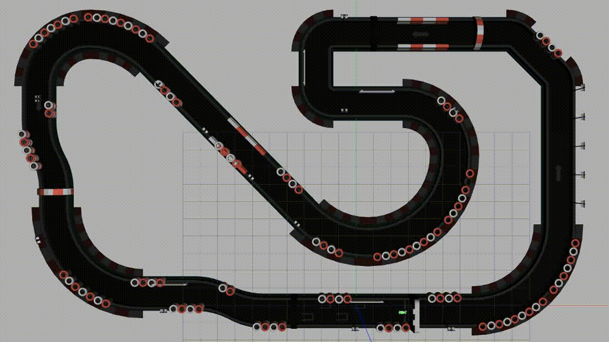

# Autonomous Racing Software Stack and Simulation Enviroment

[](https://travis-ci.com/Autonomous-Racing-PG/ar-tu-do)

This repository contains software for 1/10th scale autonomous race cars to compete in the [F1/10 competition](http://f1tenth.org/). It is developed by the Autonomous Racing Project Group of [TU Dortmund](https://ls12-www.cs.tu-dortmund.de/daes/).




## Features

We provide several LIDAR based driving algorithms:

- Fast and efficient wallfollowing based on fitting circles into the LIDAR scan
- [ROS navigation stack](http://wiki.ros.org/navigation) based implementation that uses SLAM, a precalculated map and path planning
- Deep Reinforcement Learning ([Q-Learning](https://en.wikipedia.org/wiki/Q-learning) and [Policy Gradient](https://en.wikipedia.org/wiki/Reinforcement_learning#Direct_policy_search))
- Neural Networks with evolutionary training

Our software works on physical hardware and in a simulated environment using [Gazebo](http://gazebosim.org/).
Further features are:

- Automatic emergency braking
- Dead Man's Switch
- Teleoperation via keyboard, Xbox and Playstation controller
- Speedometer and Lap Timer


## Installation

You need to install the [Robot Operating System (ROS)](https://www.ros.org/) to use our software. We target [ROS Kinetic](http://wiki.ros.org/kinetic/Installation) on Ubuntu 16.04, but [ROS Melodic](http://wiki.ros.org/melodic/Installation) seems to work as well.

Note for VM users: Gazebo 7.0.0, which is installed with ROS Kinetic by default, [does not work](https://bitbucket.org/osrf/gazebo/issues/1837/vmware-rendering-z-ordering-appears-random) on a virtual machine. To solve this, Gazebo has to be updated to at least 7.4.0 [as explained here](http://gazebosim.org/tutorials?cat=install&tut=install_ubuntu&ver=7.0#Alternativeinstallation:step-by-step).

Install dependencies:

```bash
sudo pip uninstall pip && sudo apt install python-pip
sudo apt install libsdl2-dev clang-format python-pyqtgraph
pip install torch autopep8 cython circle-fit

# RangeLibc
git clone http://github.com/kctess5/range_libc
cd range_libc/pywrapper
# Either:
./compile.sh            # on VM
# Or:
./compile_with_cuda.sh  # on car - compiles GPU ray casting methods
```

Clone the repository:

```bash
git clone --recurse-submodules https://github.com/Autonomous-Racing-PG/ar-tu-do.git
```

Install missing ROS dependencies:

```bash
cd ar-tu-do/ros_ws
rosdep install -y --from-paths src --ignore-src --rosdistro ${ROS_DISTRO}
```


## Usage

Compile while inside the `ros_ws`directory:

```bash
catkin_make
```

Set up enviroment variables for your shell:

```bash
source devel/setup.bash # (or setup.zsh, depending on your shell)
```

Use a launch file to start ROS and Gazebo:

```bash
roslaunch launch/car.launch                   # (Physical car, Wallfollowing)
roslaunch launch/car_navigation_stack.launch  # (Physical car, SLAM & ROS navigation)
roslaunch launch/gazebo.launch                # (Simulation, Wallfollowing)
roslaunch launch/navigation_stack.launch      # (Simulation, SLAM & ROS navigation)
roslaunch launch/q_learning.launch            # (Simulation, Train the Q-Learning model)
roslaunch launch/policy_gradient.launch       # (Simulation, Train the Policy Gradient model)
roslaunch launch/evolutionary.launch          # (Simulation, Train the evolutionary neural network)
```

### Launch file arguments

These arguments can be passed to the launch files above. For example, to use the `gazebo.launch` file without emergency stop and with car highlighting, run:
```
roslaunch launch/gazebo.launch emergency_stop:=false car_highlighting:=true
```
The arguments can be changed permanently by editing the launch files. 

<table>
  <tr>
    <th rowspan="2">Argument</th>
    <th rowspan="2">Description</th>
    <th colspan="5">Supported by <code>launch/&lt;file&gt;.launch</code></th>
  </tr>
  <tr>
    <td>car</td>
    <td>car_navstack</td>
    <td>gazebo</td>
    <td>navigation_stack</td>
    <td>q_learning, policy_gradient, evolutionary</td>
  </tr>
  <tr>
    <td><code>debug</code></td>
    <td>Boolean value whether Gazebo should run in debug mode. Defaults to false.</td>
    <td>✗</td>
    <td>✗</td>
    <td>✓</td>
    <td>✓</td>
    <td>✗</td>
  </tr>
  <tr>
    <td><code>emergency_stop</code></td>
    <td>Boolean value whether the emergency stop should be active. Defaults to true.</td>
    <td>✗</td>
    <td>✗</td>
    <td>✓</td>
    <td>✗</td>
    <td>✗</td>
  </tr>
  <tr>
    <td><code>gui</code></td>
    <td>Boolean value whether Gazebo should show a user interface. Defaults to true.</td>
    <td>✗</td>
    <td>✗</td>
    <td>✓</td>
    <td>✓</td>
    <td>✓</td>
  </tr>
  <tr>
    <td><code>joystick_type</code></td>
    <td>The type of joystick controller. Possible values: <code>ps3</code>, <code>xbox360</code> and <code>xboxone</code></td>
    <td>✓</td>
    <td>✓</td>
    <td>✓</td>
    <td>✓</td>
    <td>✗</td>
  </tr>
  <tr>
    <td><code>map</code></td>
    <td>Name of the map to be used by the particle filter. Defaults to a prerecorded map of <code>racetrack_decorated_2</code>.</td>
    <td>✗</td>
    <td>✓<br>(no default)</td>
    <td>✗</td>
    <td>✓</td>
    <td>✗</td>
  </tr>
  <tr>
    <td><code>paused</code></td>
    <td>Boolean value whether Gazebo should start paused. Defaults to false.</td>
    <td>✗</td>
    <td>✗</td>
    <td>✓</td>
    <td>✓</td>
    <td>✗</td>
  </tr>
  <tr>
    <td><code>pf_angle_step</code></td>
    <td>Angle step of the particle filter. Defaults to 18.</td>
    <td>✗</td>
    <td>✓</td>
    <td>✗</td>
    <td>✓</td>
    <td>✗</td>
  </tr>
  <tr>
    <td><code>pf_max_particles</code></td>
    <td>Maximum amount of particles to be used by the particle filter. Defaults to 500.</td>
    <td>✗</td>
    <td>✓</td>
    <td>✗</td>
    <td>✓</td>
    <td>✗</td>
  </tr>
  <tr>
    <td><code>pf_squash_factor</code></td>
    <td>Squash factor of the particle filter. Defaults to 2.2.</td>
    <td>✗</td>
    <td>✓</td>
    <td>✗</td>
    <td>✓</td>
    <td>✗</td>
  </tr>
  <tr>
    <td><code>plot_window</code></td>
    <td>Integer value indicating the amount of episodes that should be plotted. Defaults to 200.</td>
    <td>✗</td>
    <td>✗</td>
    <td>✗</td>
    <td>✗</td>
    <td>✓ / ✓ / ✗</td>
  </tr>
  <tr>
    <td><code>realtime_simulation</code></td>
    <td>Boolean value whether Gazebo should try to simulate with a real time factor of 1. If false, Gazebo tries to simulate as fast as possible. Defaults to true.</td>
    <td>✗</td>
    <td>✗</td>
    <td>✗</td>
    <td>✗</td>
    <td>✓</td>
  </tr>
  <tr>
    <td><code>use_gpu</code></td>
    <td>Boolean value whether Gazebo should use the GPU when simulating the lidar. Defaults to true.</td>
    <td>✗</td>
    <td>✗</td>
    <td>✓</td>
    <td>✓</td>
    <td>✓</td>
  </tr>
  <tr>
    <td><code>use_sim_time</code></td>
    <td>Boolean value whether all ros nodes should use simulated Gazebo time instead of wall clock time. Defaults to true.</td>
    <td>✗</td>
    <td>✗</td>
    <td>✓</td>
    <td>✓</td>
    <td>✗</td>
  </tr>
  <tr>
    <td><code>verbose</code></td>
    <td>Boolean value whether Gazebo should give verbose standard output. Defaults to true.</td>
    <td>✗</td>
    <td>✗</td>
    <td>✓</td>
    <td>✓</td>
    <td>✗</td>
  </tr>
  <tr>
    <td><code>visualize_lidar</code></td>
    <td>Boolean value whether Gazebo should show the simulated lidar rays. Defaults to false.</td>
    <td>✗</td>
    <td>✗</td>
    <td>✓</td>
    <td>✓</td>
    <td>✗</td>
  </tr>
  <tr>
    <td><code>world</code></td>
    <td>The name of the racetrack. Possible values: <code>racetrack_decorated</code>, <code>racetrack_decorated_2</code> (default) and <code>racetrack_decorated_2_big</code></td>
    <td>✗</td>
    <td>✗</td>
    <td>✓</td>
    <td>✓</td>
    <td>✓</td>
  </tr>
</table>

## Hardware

Our car is based on a 1/10th scale RC car ([Traxxas Ford Fiesta](https://traxxas.com/products/models/electric/ford-fiesta-st-rally)) with these additions:

- CPU/GPU board ([NVIDIA Jetson](https://www.nvidia.com/object/jetson-tk1-embedded-dev-kit.html))
- motor controller ([FOCBOX](https://www.enertionboards.com/FOCBOX-foc-motor-speed-controller.html))
- LIDAR scanner ([Hokuyo UST-10LX](https://www.hokuyo-usa.com/products/scanning-laser-rangefinders/ust-10lx))
- an inertial measurement unit ([Invensense MPU-9250](https://www.invensense.com/products/motion-tracking/9-axis/mpu-9250/))
- optional: brushless DC motor (replaces the standard brushed motor)
- optional: stereo camera ([ZED](https://www.stereolabs.com/zed/))


## Documentation

* For general information and documentation check out our [wiki page](https://github.com/Autonomous-Racing-PG/ar-tu-do/wiki).
* For source code documentation check out the auto-generated [Doxygen documentation](https://autonomous-racing-pg.github.io/ar-tu-do/html/index.html).

## License

This project (excluding git submodules) is under MIT and GPLv3 dual licensed - see the [MIT.LICENSE](MIT.LICENSE) and [GPLv3.LICENSE](GPLv3.LICENSE) file for details.